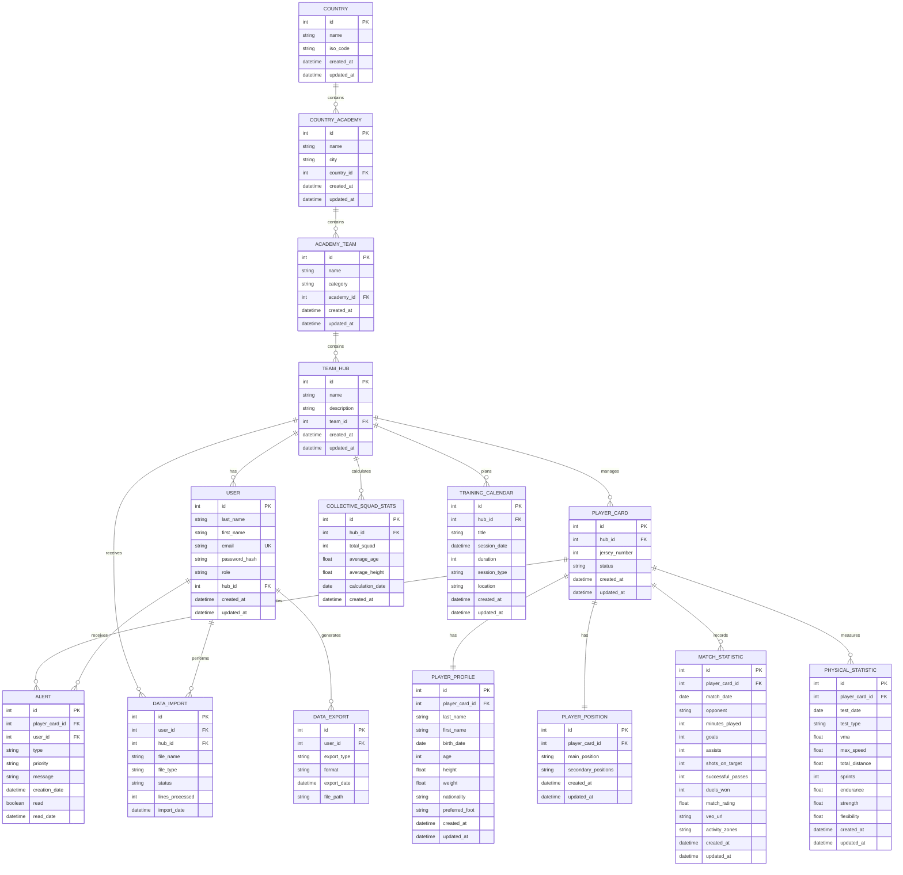

<h1 align="center">PSG Académie - Plateforme d'Analyse Football</h1>
<div align="center">
  
</div>

<div align="center">
   Plateforme d'analyse complète pour le suivi physique et tactique des joueurs de l'académie PSG, intégrant les données GPS Catapult et les statistiques de match Veo.
</div>

## 📋 Table des matières

- [Diagramme de classes](#-diagramme-de-classes)
---
- [Prérequis](#-prérequis)
- [Installation](#-installation)
- [Démarrage rapide](#-démarrage-rapide)
- [Architecture](#-architecture)
- [Fonctionnalités](#-fonctionnalités)
- [Structure du projet](#-structure-du-projet)
- [Commandes utiles](#-commandes-utiles)
- [Développement Frontend](#-développement-frontend)
- [Documentation](#-documentation)
- [Workflow de développement](#-workflow-de-développement)
- [Tests](#-tests)
---
- [Auteurs](#-auteurs)

## [Diagramme de classes](#-table-des-matières)
### Database Schema (PostgreSQL)


## 🔧 [Prérequis](#-table-des-matières)
Avant de commencer, assurez-vous d'avoir installé :
- **Git** - [Télécharger Git](#https://git-scm.com/install/)
- **Docker** (version 20.10 ou supérieure) - [Télécharger Docker](#https://docs.docker.com/get-started/get-docker/)
- **Docker Compose** (pour développement local) - Inclus avec Docker Desktop
- **Node.js 18+** (pour développement frontend local) - [Télécharger Node.js](#https://nodejs.org/fr)
- **Python 3.11+** (optionnel, pour développement backend local)

Vérifier les installations :
```bash
git --version
docker --version
docker-compose --version
node --version
npm --version
```

## 🚀 [Installation](#-table-des-matières)

1. Cloner le repository
```bash
# Cloner le projet sur la branche loic
git clone -b loic https://github.com/loicleguen/psg-academie.git
cd psg-academie
```
Ou si vous avez déjà cloné le repo :
```bash
git clone https://github.com/loicleguen/psg-academie.git
cd psg-academie
git checkout loic
```

2. Vérifier la structure
```bash
# Lister les dossiers principaux
ls -la
# Vous devriez voir : backend-catapult, backend-veo, frontend, docker-compose.yml
```

3. Lancer tous les services
```bash
# Construire et démarrer tous les conteneurs Docker
docker-compose up -d --build
```
Cette commande va :
   - 🐳 Construire les images Docker pour les backends et le frontend
   - 🗄️ Créer et démarrer les bases de données PostgreSQL
   - ⚡ Lancer les APIs FastAPI (Catapult & Veo)
   - 🌐 Démarrer le serveur Nginx
   - 🔄 Orchestrer tout automatiquement

4. Vérifier que tout fonctionne
```bash
# Vérifier l'état des conteneurs
docker-compose ps

# Voir les logs en temps réel
docker-compose logs -f

# Voir les logs d'un service spécifique
docker-compose logs -f backend-catapult
docker-compose logs -f backend-veo
docker-compose logs -f frontend
```

## 🌐 [Démarrage rapide](#-table-des-matières)

Une fois les services démarrés, accédez à :

|Service	            |URL	                            |Description                       |
|--------------------|---------------------------------|----------------------------------|
|Frontend 🎨        |http://localhost                  |Interface utilisateur principale  |
|API Catapult 🏃    |http://localhost/api/physical/    |API données physiques GPS         |
|API Veo ⚽         |http://localhost/api/tactical/    |API données tactiques matchs      |
|Docs Catapult 📚   |http://localhost/api/physical/docs|Documentation Swagger API Catapult|
|Docs Veo 📚        |http://localhost/api/tactical/docs|Documentation Swagger API Veo     |


## 🏗️ [Architecture](#-table-des-matières)

Cette plateforme intègre **deux systèmes d'analyse complémentaires** :

### 🏃 Backend Catapult (Analyse Physique)
- **Données** : GPS, distance, vitesse, accélération, charge physique
- **Base de données** : PostgreSQL 16 (psg_db_catapult)
- **API** : FastAPI + SQLModel
- **Route** : `/api/physical/*` (via nginx)
- **Port interne** : 8000

### ⚽ Backend Veo (Analyse Tactique)
- **Données** : Matchs, buts, passes, statistiques tactiques
- **Base de données** : PostgreSQL 16 (psg_db_veo)
- **API** : FastAPI + SQLAlchemy
- **Route** : `/api/tactical/*` (via nginx)
- **Port interne** : 8001

### 🎨 Frontend
- **Framework** : React 18 + Vite
- **UI** : Interface de visualisation des données et génération de rapports
- **Graphiques** : Recharts pour les visualisations
- **Routing** : React Router

### 🔀 Nginx (Reverse Proxy)
- **Ports** : 80 (HTTP) / 443 (HTTPS)
- Routage automatique vers le bon backend selon l'URL
- Service du frontend React en production


## 📊 [Fonctionnalités](#-table-des-matières)

### Module Catapult (Physique)
- ✅ Upload de fichiers CSV Catapult
- ✅ Parsing automatique des données GPS
- ✅ Détection des phases d'entraînement (échauffement, match, cool-down)
- ✅ Génération de graphiques :
  - Comparaison entre joueurs (distance, vitesse, charge)
  - Distribution par zones de vitesse
  - Timeline d'intensité
  - Breakdown de distance
  - Radar de performance multi-métriques
- ✅ Analyse de sessions et de joueurs individuels
- ✅ Export de rapports PDF

### Module Veo (Tactique)
- ✅ Gestion des saisons, équipes et joueurs
- ✅ Suivi des matchs et participations
- ✅ Métriques flexibles (EAV model)
  - Métriques brutes (saisies manuellement)
  - Métriques dérivées (calculées à la volée)
- ✅ Analytics avancées :
  - KPIs d'équipe
  - Time series pour analyse temporelle
  - Radar charts pour comparaisons
  - Leaderboards joueurs
- ✅ Validation des données (pourcentages 0-100)
- ✅ Export de résumés de match (format Excel-like)


## 📁 [Structure du Projet](#-table-des-matières)

```
psg-academie/
├── backend-catapult/          # Backend données physiques
│   ├── app.py                 # Point d'entrée FastAPI
│   ├── Dockerfile
│   ├── requirements.txt
│   ├── src/
│   │   ├── models/            # Modèles SQLModel
│   │   ├── routes/            # Endpoints API
│   │   └── services/          # Logique métier
│   └── migrations/            # Migrations Alembic
│
├── backend-veo/               # Backend données tactiques
│   ├── app/
│   │   ├── main.py            # Point d'entrée FastAPI
│   │   ├── models.py          # Modèles SQLAlchemy
│   │   ├── routes/            # Endpoints API
│   │   └── services/          # Logique métier & analytics
│   ├── alembic/               # Migrations
│   ├── Dockerfile
│   └── requirements.txt
│
├── frontend/                  # Application React
│   ├── src/
│   │   ├── components/        # Composants UI
│   │   ├── App.jsx           # Application principale
│   │   └── assets/           # Ressources statiques
│   ├── package.json
│   └── vite.config.js
│
├── nginx.conf                 # Configuration reverse proxy
├── docker-compose.yml         # Orchestration des services
├── certs/                     # Certificats SSL
└── docs/                      # Documentation
    ├── GETTING_STARTED.md     # Guide de démarrage
    ├── CATAPULT_README.md     # Documentation Catapult
    ├── VEO_README.md          # Documentation Veo
    └── QUICK_REFERENCE.md     # Référence rapide
```

## 🔧 [Commandes Utiles](#-table-des-matières)

### Docker

```bash
# Démarrer tous les services
docker-compose up -d --build

# Arrêter tous les services
docker-compose down

# Voir les logs
docker-compose logs -f                    # Tous les services
docker-compose logs -f backend-catapult   # Backend Catapult uniquement
docker-compose logs -f backend-veo        # Backend Veo uniquement

# Redémarrer un service spécifique
docker-compose restart backend-catapult
docker-compose restart backend-veo

# Exécuter des commandes dans un conteneur
docker-compose exec backend-catapult bash
docker-compose exec backend-veo bash
```

### Base de données

```bash
# Migrations Catapult
docker-compose exec backend-catapult alembic upgrade head
docker-compose exec backend-catapult alembic revision --autogenerate -m "description"

# Migrations Veo
docker-compose exec backend-veo alembic upgrade head
docker-compose exec backend-veo alembic revision --autogenerate -m "description"

# Accès direct à PostgreSQL
docker-compose exec db-catapult psql -U psguser -d psgdb
docker-compose exec db-veo psql -U veo_user -d veo_db
```

## 💻 [Développement Frontend](#-table-des-matières)

```bash
cd frontend

# Installation des dépendances
npm install

# Développement
npm run dev

# Build de production
npm run build

# Preview du build
npm run preview
```

## 📖 [Documentation](#-table-des-matières)

Pour plus de détails, consultez la documentation dans le dossier `docs/` :

- **[Getting Started](docs/GETTING_STARTED.md)** - Guide de démarrage complet
- **[Catapult Module](docs/CATAPULT_README.md)** - Documentation API données physiques
- **[Veo Module](docs/VEO_README.md)** - Documentation API données tactiques
- **[Quick Reference](docs/QUICK_REFERENCE.md)** - Référence rapide des commandes
- **[Architecture](docs/architecture.md)** - Architecture détaillée du système

## 🔄 [Workflow de Développement](#-table-des-matières)

1. **Créer une branche** pour votre fonctionnalité
   ```bash
   git checkout -b feature/nom-feature
   ```

2. **Développer et tester** localement
   ```bash
   docker-compose up -d --build
   cd frontend && npm run dev
   ```

3. **Tester les APIs** via Swagger UI
   - Catapult: http://localhost/api/physical/docs
   - Veo: http://localhost/api/tactical/docs

4. **Commiter et pusher**
   ```bash
   git add .
   git commit -m "Description des changements"
   git push origin feature/nom-feature
   ```

## 🧪 [Tests](#-table-des-matières)

```bash
# Tests backend Veo
docker-compose exec backend-veo pytest

# Tests avec coverage
docker-compose exec backend-veo pytest --cov=app tests/
```

## 👥 [Auteurs](#-table-des-matières)
  
| Author | Role | GitHub | Email |
|--------|------|--------|-------|
| **Loïc Le Guen** | Co-Developer | [https://github.com/loicleguen](https://github.com/loicleguen) | 11510@holbertonstudents.com |
| **Jules Moleins** | Co-Developer | [https://github.com/Roullito](https://github.com/Roullito) | jmoleins@gmail.com |
| **Pierre-Yves Fauconnet** | Co-Developer | [https://github.com/P-Y74](https://github.com/P-Y74) | pfauconnet@proton.me |